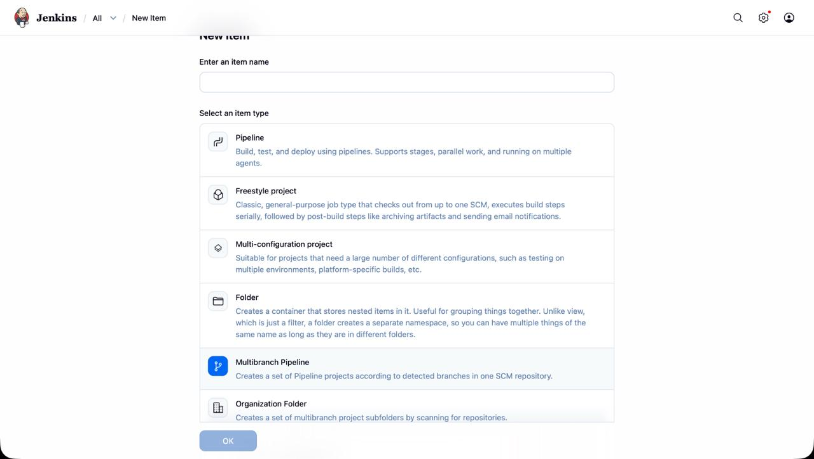
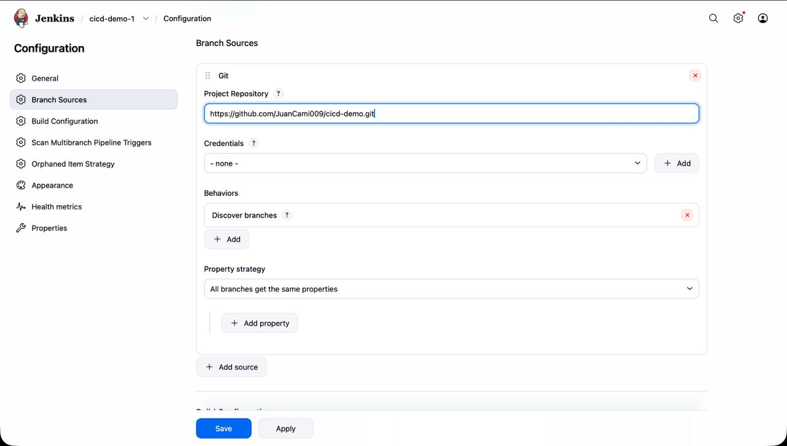
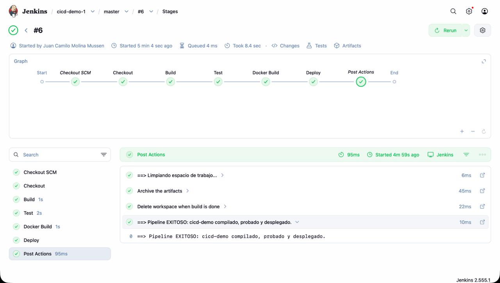
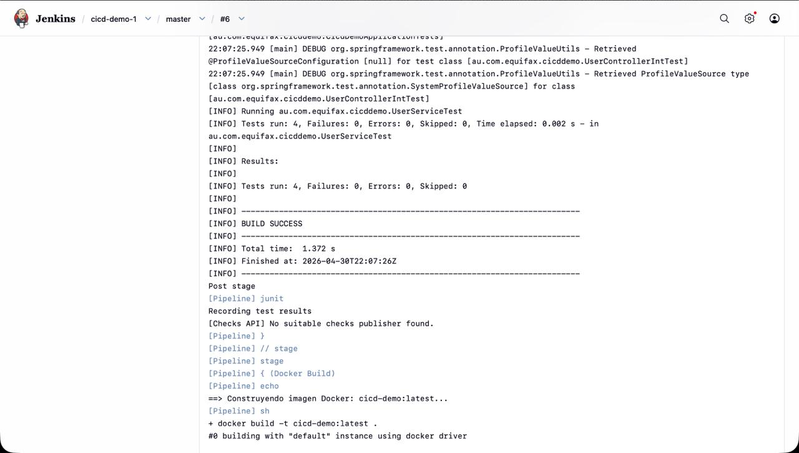
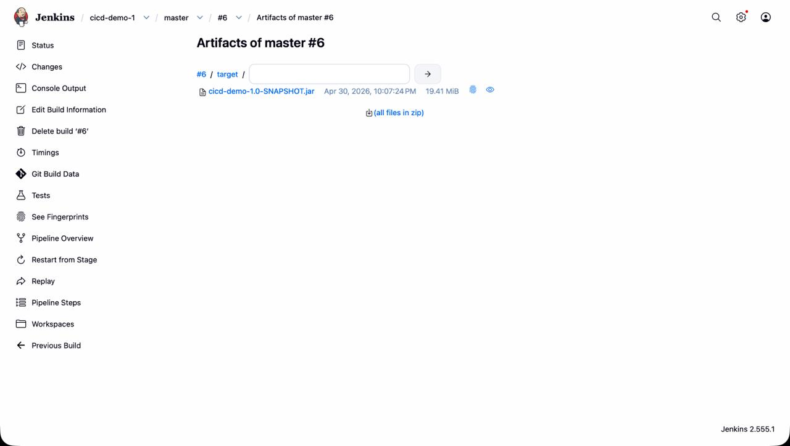
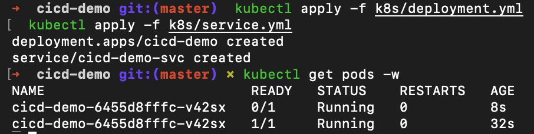
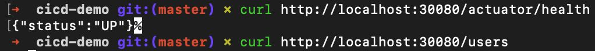

# cicd-demo — Taller CI/CD

Aplicación Spring Boot 2.1 usada como base para el ejercicio de diseño y construcción de pipelines CI/CD con **Jenkins** y **Kubernetes**.

---

## Tabla de contenido

- [cicd-demo — Taller CI/CD](#cicd-demo--taller-cicd)
  - [Tabla de contenido](#tabla-de-contenido)
  - [1. Descripción del proyecto](#1-descripción-del-proyecto)
  - [2. Prerrequisitos](#2-prerrequisitos)
    - [Jenkins en Docker](#jenkins-en-docker)
    - [Docker Desktop con Kubernetes habilitado](#docker-desktop-con-kubernetes-habilitado)
  - [3. Arquitectura del pipeline](#3-arquitectura-del-pipeline)
  - [4. Configuración de Jenkins](#4-configuración-de-jenkins)
    - [4.1 Crear el job](#41-crear-el-job)
    - [4.2 Configurar Pipeline script from SCM](#42-configurar-pipeline-script-from-scm)
    - [4.3 Primera ejecución](#43-primera-ejecución)
  - [5. Ejecución local (sin Docker)](#5-ejecución-local-sin-docker)
  - [6. Ejecución con Docker](#6-ejecución-con-docker)
  - [7. Despliegue en Kubernetes (Docker Desktop)](#7-despliegue-en-kubernetes-docker-desktop)
    - [7.1 Construir la imagen (requerido antes de desplegar)](#71-construir-la-imagen-requerido-antes-de-desplegar)
    - [7.2 Aplicar los manifiestos](#72-aplicar-los-manifiestos)
    - [7.3 Verificar el despliegue](#73-verificar-el-despliegue)
    - [7.4 Acceder a la aplicación](#74-acceder-a-la-aplicación)
    - [7.5 Actualizar el despliegue](#75-actualizar-el-despliegue)
    - [7.6 Limpiar recursos de Kubernetes](#76-limpiar-recursos-de-kubernetes)
  - [8. Endpoints de la aplicación](#8-endpoints-de-la-aplicación)
  - [9. Estructura del repositorio](#9-estructura-del-repositorio)
  - [10. Variables y configuración](#10-variables-y-configuración)
    - [Variables del Jenkinsfile](#variables-del-jenkinsfile)
    - [Categorías de tests (JUnit `@Category`)](#categorías-de-tests-junit-category)
    - [Recursos Kubernetes](#recursos-kubernetes)
  - [11. Análisis de calidad y seguridad](#11-análisis-de-calidad-y-seguridad)
    - [11.1 SonarQube](#111-sonarqube)
    - [11.2 Trivy](#112-trivy)

---

## 1. Descripción del proyecto

REST API construida con **Spring Boot 2.1** (Java 10) que expone operaciones CRUD sobre usuarios almacenados **en memoria** (sin base de datos). Sirve como proyecto de práctica para implementar un pipeline CI/CD completo.

**Stack:**

| Componente | Versión |
|---|---|
| Java | 10 (compilación) / 21 (imagen Docker — eclipse-temurin:21-jre-alpine) |
| Spring Boot | 2.1.1 |
| Maven | 3.6 (via wrapper `./mvnw`) |
| Docker | 20+ |
| Jenkins | LTS |
| Kubernetes | Docker Desktop K8s |

---

## 2. Prerrequisitos

### Jenkins en Docker

```bash
docker run -p 8080:8080 -p 50000:50000 \
  -v jenkins_home:/var/jenkins_home \
  -v /var/run/docker.sock:/var/run/docker.sock \
  jenkins/jenkins:lts
```

> **Importante:** montar `/var/run/docker.sock` le da a Jenkins acceso al daemon Docker del host, necesario para que el pipeline ejecute `docker build` y `docker run`.

**Configuración adicional del contenedor Jenkins (una sola vez):**

Instalar el Docker CLI dentro del contenedor (el socket solo es el canal, el CLI es el binario que ejecuta los comandos):

```bash
docker exec -u root <id-contenedor> apt-get update && \
docker exec -u root <id-contenedor> apt-get install -y docker.io
```

Dar permisos al socket para que el usuario `jenkins` pueda usarlo:

```bash
docker exec -u root <id-contenedor> chmod 666 /var/run/docker.sock
```

> **Nota:** el `chmod 666` se pierde si el contenedor se reinicia. Para que sea permanente, agregar esta línea al arrancar Jenkins o usar una imagen personalizada.

### SonarQube y herramientas de análisis

Instalar `jq` en el contenedor Jenkins (necesario para parsear las respuestas JSON de la API SonarQube):

```bash
docker exec -u root <id-contenedor> apt-get install -y jq
```

Iniciar SonarQube como contenedor Docker en el host (una sola vez):

```bash
docker run -d \
  --name sonarqube \
  -p 9001:9000 \
  -e SONAR_ES_BOOTSTRAP_CHECKS_DISABLE=true \
  sonarqube:community
```

Acceder a `http://localhost:9001` y hacer login con `admin/admin`. Si el sistema solicita cambiar la contraseña, actualizar el valor de `SONAR_TOKEN` en el `Jenkinsfile`.

> **Nota:** SonarQube tarda entre 60 y 90 segundos en arrancar la primera vez mientras inicializa su base de datos interna.

<!-- CAPTURA: screenshot de http://localhost:9000 mostrando la pantalla de login de SonarQube -->

**Plugins requeridos** (instalar desde *Manage Jenkins > Plugin Manager*):

| Plugin | Uso |
|---|---|
| Git | Clonar repositorios |
| Pipeline | Ejecutar Jenkinsfile declarativos |
| Docker Pipeline | Comandos Docker en el pipeline |
| JUnit | Publicar reportes de tests |

### Docker Desktop con Kubernetes habilitado

1. Abrir **Docker Desktop > Settings > Kubernetes**
2. Marcar **Enable Kubernetes**
3. Hacer clic en **Apply & Restart**
4. Verificar:

```bash
kubectl config current-context
# debe mostrar: docker-desktop

kubectl cluster-info
# debe mostrar la URL del cluster local
```

---

## 3. Arquitectura del pipeline

El pipeline está definido en `Jenkinsfile` con **7 etapas**:

```
┌──────────┐   ┌────────┐   ┌────────┐   ┌───────────┐   ┌──────────────┐   ┌──────────────┐   ┌────────┐
│ Checkout │──>│ Build  │──>│  Test  │──>│ SonarQube │──>│ Docker Build │──>│ Trivy  Scan  │──>│ Deploy │
│  (SCM)   │   │ (Maven)│   │(JUnit) │   │ (hotspots)│   │  (imagen)    │   │  (CRITICAL)  │   │(master)│
└──────────┘   └────────┘   └────────┘   └───────────┘   └──────────────┘   └──────────────┘   └────────┘
                                                                                                      │
                                                                                              solo rama master
```

<!-- CAPTURA: screenshot de Jenkins Stage View mostrando los 7 stages en verde -->

| Etapa | Comando / Herramienta | Descripción |
|---|---|---|
| **Checkout** | `checkout scm` | Obtiene el código desde el SCM configurado en Jenkins |
| **Build** | `./mvnw clean package -DskipTests` | Compila y genera el JAR sin ejecutar tests |
| **Test** | `./mvnw test -Dgroups=UnitTest` | Ejecuta pruebas unitarias; JaCoCo genera cobertura |
| **Static Analysis** | `./mvnw sonar:sonar` + API SonarQube | Análisis estático; falla si hay Security Hotspots sin revisar |
| **Docker Build** | `docker build -t cicd-demo:latest .` | Construye la imagen Docker de la aplicación |
| **Security Scan** | `aquasec/trivy:latest image` | Escaneo de vulnerabilidades; falla si detecta CRITICAL |
| **Deploy** | `docker run -d -p 8081:8080 cicd-demo:latest` | Despliega el contenedor *(solo en rama master)* |

**Bloque `post`:**

```
always  => archiveArtifacts (JAR + trivy-full-report.txt) + cleanWs()
success => mensaje de éxito
failure => mensaje de fallo con indicación de revisar logs
```

---

## 4. Configuración de Jenkins

### 4.1 Crear el job

1. En la pantalla principal de Jenkins, hacer clic en **New Item**
2. Ingresar un nombre (ej. `cicd-demo`)
3. Seleccionar **Multibranch Pipeline** y hacer clic en **OK**



### 4.2 Configurar Pipeline script from SCM

En la sección **Pipeline** del job:

| Campo | Valor |
|---|---|
| Definition | **Pipeline script from SCM** |
| SCM | **Git** |
| Repository URL | `https://github.com/<usuario>/cicd-demo.git` (o URL local) |
| Branch Specifier | `*/master` |
| Script Path | `Jenkinsfile` |

> Con esta configuración, Jenkins lee el `Jenkinsfile` directamente del repositorio cada vez que ejecuta el pipeline. No es necesario copiar el script en la UI.



### 4.3 Primera ejecución

1. Hacer clic en **Build Now**
2. En **Build History**, hacer clic en el número de build
3. Seleccionar **Console Output** para ver los logs en tiempo real

**Resultado esperado:**

```
==> Obteniendo código fuente desde SCM...
==> Compilando aplicación con Maven...
[INFO] BUILD SUCCESS
==> Ejecutando pruebas unitarias...
[INFO] Tests run: X, Failures: 0, Errors: 0
==> Construyendo imagen Docker: cicd-demo:latest...
Successfully built <image-id>
==> Pipeline EXITOSO: cicd-demo compilado, probado y desplegado.
```







---

## 5. Ejecución local (sin Docker)

```bash
# Compilar (genera target/cicd-demo-1.0-SNAPSHOT.jar)
./mvnw clean package -DskipTests

# Pruebas unitarias
./mvnw test -Dgroups=UnitTest

# Pruebas de integración (levanta Spring Boot en puerto aleatorio)
./mvnw integration-test -Dgroups=IntegrationTest

# Ejecutar la aplicación directamente
./mvnw spring-boot:run
# La app queda disponible en http://localhost:8080
```

---

## 6. Ejecución con Docker

```bash
# 1. Compilar el JAR primero
./mvnw clean package -DskipTests

# 2. Construir la imagen Docker
docker build -t cicd-demo:latest .

# 3. Ejecutar el contenedor
docker run -d \
  --name cicd-demo \
  -p 8081:8080 \
  --restart unless-stopped \
  cicd-demo:latest

# 4. Verificar que está corriendo
docker ps
curl http://localhost:8081/actuator/health

# 5. Ver logs del contenedor
docker logs cicd-demo

# 6. Detener y eliminar el contenedor
docker stop cicd-demo && docker rm cicd-demo
```

---

## 7. Despliegue en Kubernetes (Docker Desktop)

Los manifiestos se encuentran en el directorio `k8s/`:

```
k8s/
├── deployment.yml   # Deployment con 1 réplica + health probes
└── service.yml      # Service tipo NodePort (expone puerto 30080)
```

### 7.1 Construir la imagen (requerido antes de desplegar)

```bash
# La imagen debe construirse con el daemon Docker local.
# Docker Desktop comparte el daemon con el cluster K8s,
# por lo que no es necesario hacer push a ningún registry.
./mvnw clean package -DskipTests
docker build -t cicd-demo:latest .
```

### 7.2 Aplicar los manifiestos

```bash
# Crear el Deployment
kubectl apply -f k8s/deployment.yml

# Crear el Service (NodePort)
kubectl apply -f k8s/service.yml
```

### 7.3 Verificar el despliegue



```bash
# Ver el estado del Deployment
kubectl get deployments
# NAME        READY   UP-TO-DATE   AVAILABLE
# cicd-demo   1/1     1            1

# Ver el Pod
kubectl get pods
# NAME                         READY   STATUS    RESTARTS
# cicd-demo-<hash>             1/1     Running   0

# Ver el Service y el NodePort asignado
kubectl get svc cicd-demo-svc
# NAME            TYPE       CLUSTER-IP     PORT(S)        AGE
# cicd-demo-svc   NodePort   10.x.x.x       80:30080/TCP   Xs

# Ver logs del Pod
kubectl logs deployment/cicd-demo
```

### 7.4 Acceder a la aplicación



Con Docker Desktop K8s, el nodo es `localhost`:

```bash
# Health check
curl http://localhost:30080/actuator/health
# {"status":"UP"}

# Listar usuarios (vacío al inicio)
curl http://localhost:30080/users

# Crear un usuario
curl -X POST http://localhost:30080/users \
  -H "Content-Type: application/json" \
  -d '{"login":"juanc","email":"juan@example.com","name":"Juan Camilo"}'
```

### 7.5 Actualizar el despliegue

Cuando se construye una nueva versión de la imagen:

```bash
# Reconstruir imagen
docker build -t cicd-demo:latest .

# Forzar reinicio del Pod para que tome la nueva imagen
kubectl rollout restart deployment/cicd-demo

# Monitorear el rollout
kubectl rollout status deployment/cicd-demo
```

### 7.6 Limpiar recursos de Kubernetes

```bash
kubectl delete -f k8s/service.yml
kubectl delete -f k8s/deployment.yml
```

---

## 8. Endpoints de la aplicación

| Método | Ruta | Descripción |
|---|---|---|
| `GET` | `/` | Info del host (hostname, IP, OS) |
| `GET` | `/users` | Listar todos los usuarios |
| `GET` | `/users/{id}` | Obtener usuario por ID |
| `POST` | `/users` | Crear nuevo usuario |
| `GET` | `/actuator/health` | Health probe (usado por K8s liveness/readiness) |

**Modelo de usuario:**

```json
{
  "id": 1,
  "login": "jcmolina",
  "email": "jc@example.com",
  "name": "Juan Camilo"
}
```

> La igualdad entre usuarios se basa únicamente en `login` + `email` (no en `id`).
> Los datos se almacenan **en memoria** y se pierden al reiniciar el contenedor.

---

## 9. Estructura del repositorio

```
cicd-demo/
├── Jenkinsfile              # Pipeline CI/CD (Punto 2 del taller — 7 stages)
├── Dockerfile               # Imagen Docker: eclipse-temurin:21-jre-alpine
├── Makefile                 # Targets auxiliares para docker-compose
├── docker-compose.yml       # Servicios: builder (Maven), selenium
├── pom.xml                  # Configuración Maven / Spring Boot 2.1
├── mvnw / mvnw.cmd          # Maven wrapper (no requiere Maven instalado)
├── k8s/
│   ├── deployment.yml       # Deployment K8s (1 réplica, health probes)
│   └── service.yml          # Service NodePort (puerto 30080)
└── src/
    ├── main/java/.../
    │   ├── controller/      # ApiController, UserController
    │   ├── service/         # UserService (interface + impl en ArrayList)
    │   └── domain/          # User (builder pattern), EnvDetail
    └── test/java/.../
        ├── UserServiceTest.java       # @Category(UnitTest)
        ├── UserControllerIntTest.java # @Category(IntegrationTest)
        └── SeleniumExampleTest.java   # @Category(SystemTest)
```

---

## 10. Variables y configuración

### Variables del Jenkinsfile

| Variable | Valor por defecto | Descripción |
|---|---|---|
| `APP_NAME` | `cicd-demo` | Nombre de la aplicación y del contenedor Docker |
| `IMAGE_TAG` | `cicd-demo:latest` | Tag completo de la imagen Docker construida |
| `SONAR_URL` | `http://host.docker.internal:9001` | URL de SonarQube accesible desde el contenedor Jenkins |
| `SONAR_TOKEN` | `sqa_...` | Token de autenticación generado en SonarQube (My Account → Security) |
| `SONAR_PROJECT_KEY` | `cicd-demo` | Identificador del proyecto en SonarQube |

### Categorías de tests (JUnit `@Category`)

| Categoría | Comando | Descripción |
|---|---|---|
| `UnitTest` | `./mvnw test -Dgroups=UnitTest` | Tests sin Spring context (rápidos) |
| `IntegrationTest` | `./mvnw integration-test -Dgroups=IntegrationTest` | Tests HTTP con `@SpringBootTest` |
| `SystemTest` | `APP_URL=http://... ./mvnw test -Dgroups=SystemTest` | Tests Selenium contra app desplegada |

### Recursos Kubernetes

| Recurso | Tipo | Puerto externo | Puerto interno |
|---|---|---|---|
| `cicd-demo` | Deployment | — | 8080 |
| `cicd-demo-svc` | Service (NodePort) | 30080 | 8080 |

---

## 11. Análisis de calidad y seguridad

### 11.1 SonarQube

SonarQube analiza el código fuente en busca de bugs, code smells y **Security Hotspots**. El pipeline falla si detecta algún hotspot en estado `TO_REVIEW`, bloqueando el despliegue hasta que sea revisado y marcado como resuelto o aceptado.

**Acceder al dashboard:**

```
http://localhost:9001/dashboard?id=cicd-demo
```

<!-- CAPTURA: screenshot del dashboard de SonarQube mostrando el proyecto cicd-demo con el resultado del análisis -->

**Verificar Security Hotspots via API:**

```bash
curl -s -u admin:admin \
  "http://localhost:9001/api/hotspots/search?projectKey=cicd-demo&status=TO_REVIEW" \
  | jq '.paging.total'
# Resultado esperado: 0
```

<!-- CAPTURA: screenshot de la sección Security Hotspots en el dashboard de SonarQube mostrando 0 hotspots pendientes -->

**Ver hotspots pendientes:**

```
http://localhost:9001/security_hotspots?id=cicd-demo
```

**Detalle del quality gate en el pipeline:**

El stage `Static Analysis (SonarQube)` ejecuta el siguiente flujo:

1. Lanza `./mvnw sonar:sonar` y obtiene el `ceTaskId` de `target/sonar/report-task.txt`
2. Hace polling a `/api/ce/task?id=<ceTaskId>` hasta que el análisis termine
3. Consulta `/api/hotspots/search?projectKey=cicd-demo&status=TO_REVIEW`
4. Si `paging.total > 0` → falla el pipeline con `error()`

<!-- CAPTURA: screenshot de la consola de Jenkins mostrando el output del stage Static Analysis con "Quality Gate SonarQube: PASSED" -->

---

### 11.2 Trivy

Trivy escanea la imagen Docker en busca de vulnerabilidades conocidas (CVEs) en paquetes del sistema operativo y dependencias. El pipeline falla si detecta alguna vulnerabilidad **CRITICAL**, bloqueando el despliegue.

**Ejecutar manualmente (fuera del pipeline):**

```bash
docker run --rm \
  -v /var/run/docker.sock:/var/run/docker.sock \
  aquasec/trivy:latest image \
    --severity LOW,MEDIUM,HIGH,CRITICAL \
    cicd-demo:latest
```

<!-- CAPTURA: screenshot del reporte completo de Trivy en la terminal mostrando las vulnerabilidades encontradas por severidad -->

**Reporte archivado en Jenkins:**

Cada ejecución del pipeline genera el artefacto `trivy-full-report.txt` con el reporte completo (todas las severidades) disponible para descarga desde la UI de Jenkins.

<!-- CAPTURA: screenshot de la sección "Last Successful Artifacts" en Jenkins mostrando trivy-full-report.txt -->

**Detalle del quality gate en el pipeline:**

El stage `Security Scan (Trivy)` ejecuta Trivy dos veces:

1. Con `--exit-code 0` para generar `trivy-full-report.txt` (todas las severidades, no falla)
2. Con `--exit-code 1 --severity CRITICAL` para el quality gate (falla si hay al menos 1 CRITICAL)

<!-- CAPTURA: screenshot de la consola de Jenkins mostrando el output del stage Security Scan con "Quality Gate Trivy: PASSED" -->
